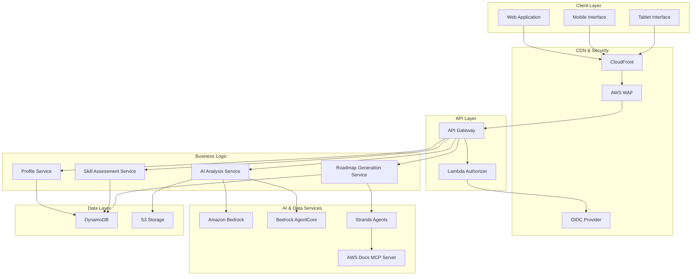

# Design Document: AWS Certification Learning Roadmap

## Overview

The AWS Certification Learning Roadmap application is a serverless web platform that leverages AI to create personalized study plans for AWS certification preparation. The system combines user profiling, skill assessment, and AI-powered analysis to generate tailored learning roadmaps based on official AWS documentation and exam guides.

The application follows a serverless-first architecture using AWS Lambda, API Gateway, DynamoDB, and integrates with Bedrock foundation models and AgentCore for intelligent analysis. The frontend provides a responsive experience across mobile, tablet, and desktop devices with secure OIDC authentication.

## Architecture

### High-Level Architecture



### Serverless Architecture Principles

The application follows AWS serverless best practices:
- **Event-driven**: Lambda functions triggered by API Gateway events
- **Stateless**: No server state maintained between requests
- **Auto-scaling**: Automatic scaling based on demand
- **Pay-per-use**: Cost optimization through serverless pricing model
- **Managed services**: Leveraging fully managed AWS services

## Components and Interfaces

### Frontend Application

**Technology Stack:**
- React with TypeScript for type safety and maintainability
- Responsive design using CSS Grid and Flexbox
- Progressive Web App (PWA) capabilities for mobile experience
- State management with React Context API
- Authentication integration with OIDC provider

**Key Components:**
- `ProfileCreationForm`: Captures user certification goals and experience
- `SkillAssessmentMatrix`: Interactive skill rating interface
- `RoadmapVisualization`: Displays personalized learning paths
- `ProgressTracker`: Shows completion status and milestones

### API Gateway Configuration

**Endpoints:**
- `POST /api/profile` - Create/update user profile
- `GET /api/profile/{userId}` - Retrieve user profile
- `POST /api/skill-assessment` - Submit skill ratings
- `GET /api/skill-assessment/{userId}` - Get current skill assessment
- `POST /api/analyze` - Trigger AI analysis
- `GET /api/roadmap/{userId}` - Retrieve generated roadmap
- `POST /api/roadmap/customize` - Update roadmap preferences

**Security Configuration:**
- Lambda authorizer for JWT token validation
- CORS configuration for cross-origin requests
- Request throttling and rate limiting
- Input validation and sanitization

### Lambda Functions

#### Profile Service (`profile-service`)
**Purpose:** Manages user profile data and certification preferences
**Runtime:** Node.js 20.x
**Memory:** 512 MB
**Timeout:** 30 seconds

**Key Functions:**
- Validate and store user profile information
- Prepopulate skill assessments based on role and experience
- Handle profile updates and versioning

#### Skill Assessment Service (`skill-assessment-service`)
**Purpose:** Processes skill ratings and maintains assessment history
**Runtime:** Node.js 20.x
**Memory:** 256 MB
**Timeout:** 15 seconds

**Key Functions:**
- Store and retrieve skill ratings by service category
- Calculate skill gaps and proficiency scores
- Track assessment changes over time

#### AI Analysis Service (`ai-analysis-service`)
**Purpose:** Orchestrates AI-powered knowledge gap analysis
**Runtime:** Python 3.11
**Memory:** 1024 MB
**Timeout:** 300 seconds

**Key Functions:**
- Integrate with Bedrock foundation models for analysis
- Process user data through AgentCore agents
- Generate knowledge gap assessments and recommendations

#### Roadmap Generation Service (`roadmap-service`)
**Purpose:** Creates personalized learning roadmaps using Strands agents
**Runtime:** Python 3.11
**Memory:** 1024 MB
**Timeout:** 300 seconds

**Key Functions:**
- Query AWS documentation via MCP server
- Generate structured learning paths
- Customize roadmaps based on user preferences

### AI Integration Architecture

#### Bedrock Foundation Models
**Primary Model:** Anthropic Claude 3.5 Sonnet
- **Use Case:** Knowledge gap analysis and recommendation generation
- **Input:** User profile, skill assessments, certification requirements
- **Output:** Structured analysis of learning needs and focus areas

**Secondary Model:** Amazon Titan Text Express
- **Use Case:** Content summarization and learning resource curation
- **Input:** AWS documentation and training materials
- **Output:** Condensed learning materials and key concepts

#### AgentCore Integration
**Agent Configuration:**
- **Runtime:** Secure execution environment with extended timeout
- **Memory:** Persistent memory for user context and analysis history
- **Tools:** Integration with AWS documentation APIs and certification databases
- **Observability:** Built-in monitoring and performance tracking

**Agent Workflow:**
1. Receive user profile and skill assessment data
2. Query certification requirements from official sources
3. Analyze knowledge gaps using foundation models
4. Generate prioritized learning recommendations
5. Return structured analysis results

#### Strands Agents Implementation
**Agent Purpose:** Intelligent roadmap generation and customization
**SDK Configuration:**
- **Model:** Bedrock Claude 3.5 Sonnet
- **Tools:** AWS documentation MCP server, certification database
- **Deployment:** AWS Lambda with container image

**Agent Capabilities:**
- Parse official AWS exam guides
- Match user skills against certification requirements
- Generate time-based learning schedules
- Provide resource recommendations and study materials

## Data Models

### User Profile Schema
```typescript
interface UserProfile {
  userId: string;
  targetCertification: CertificationType;
  awsExperienceYears: number;
  currentRole: UserRole;
  activeCertifications: CertificationType[];
  createdAt: string;
  updatedAt: string;
  version: number;
}

enum CertificationType {
  CLOUD_PRACTITIONER = "aws-certified-cloud-practitioner",
  AI_PRACTITIONER = "aws-certified-ai-practitioner",
  SOLUTIONS_ARCHITECT_ASSOCIATE = "aws-certified-solutions-architect-associate",
  DEVELOPER_ASSOCIATE = "aws-certified-developer-associate",
  CLOUDOPS_ENGINEER_ASSOCIATE = "aws-certified-cloudops-engineer-associate",
  DATA_ENGINEER_ASSOCIATE = "aws-certified-data-engineer-associate",
  MACHINE_LEARNING_ENGINEER_ASSOCIATE = "aws-certified-machine-learning-engineer-associate",
  SOLUTIONS_ARCHITECT_PROFESSIONAL = "aws-certified-solutions-architect-professional",
  DEVOPS_ENGINEER_PROFESSIONAL = "aws-certified-devops-engineer-professional",
  GENERATIVE_AI_DEVELOPER_PROFESSIONAL = "aws-certified-generative-ai-developer-professional",
  SECURITY_SPECIALTY = "aws-certified-security-specialty",
  MACHINE_LEARNING_SPECIALTY = "aws-certified-machine-learning-specialty",
  ADVANCED_NETWORKING_SPECIALTY = "aws-certified-advanced-networking-specialty"
}

enum UserRole {
  DEVELOPER = "developer",
  SOLUTIONS_ARCHITECT = "solutions-architect",
  DEVOPS_ENGINEER = "devops-engineer",
  DATA_ENGINEER = "data-engineer",
  SECURITY_ENGINEER = "security-engineer",
  SYSTEM_ADMINISTRATOR = "system-administrator",
  CLOUD_ARCHITECT = "cloud-architect",
  STUDENT = "student",
  OTHER = "other"
}
```

### Skill Assessment Schema
```typescript
interface SkillAssessment {
  userId: string;
  assessmentId: string;
  serviceCategories: ServiceCategoryRating[];
  overallScore: number;
  createdAt: string;
  isCustomized: boolean;
}

interface ServiceCategoryRating {
  category: ServiceCategory;
  services: ServiceRating[];
  categoryScore: number;
}

interface ServiceRating {
  serviceName: string;
  proficiencyLevel: number; // 1-5 scale
  isCore: boolean; // Core service for target certification
  lastUpdated: string;
}

enum ServiceCategory {
  COMPUTE = "compute",
  STORAGE = "storage",
  DATABASE = "database",
  NETWORKING = "networking",
  SECURITY = "security",
  ANALYTICS = "analytics",
  MACHINE_LEARNING = "machine-learning",
  CONTAINERS = "containers",
  SERVERLESS = "serverless",
  MANAGEMENT = "management",
  DEVELOPER_TOOLS = "developer-tools",
  IOT = "iot",
  MIGRATION = "migration"
}
```

### Learning Roadmap Schema
```typescript
interface LearningRoadmap {
  userId: string;
  roadmapId: string;
  targetCertification: CertificationType;
  focusAreas: FocusArea[];
  estimatedDuration: number; // weeks
  difficulty: DifficultyLevel;
  createdAt: string;
  customizations: RoadmapCustomization[];
  progress: RoadmapProgress;
}

interface FocusArea {
  areaId: string;
  title: string;
  description: string;
  priority: Priority;
  estimatedHours: number;
  services: string[];
  resources: LearningResource[];
  prerequisites: string[];
  milestones: Milestone[];
}

interface LearningResource {
  type: ResourceType;
  title: string;
  url: string;
  estimatedTime: number; // minutes
  difficulty: DifficultyLevel;
  isOfficial: boolean;
}

enum ResourceType {
  DOCUMENTATION = "documentation",
  TUTORIAL = "tutorial",
  VIDEO = "video",
  HANDS_ON_LAB = "hands-on-lab",
  PRACTICE_EXAM = "practice-exam",
  WHITEPAPER = "whitepaper",
  CASE_STUDY = "case-study"
}

enum Priority {
  CRITICAL = "critical",
  HIGH = "high",
  MEDIUM = "medium",
  LOW = "low"
}

enum DifficultyLevel {
  BEGINNER = "beginner",
  INTERMEDIATE = "intermediate",
  ADVANCED = "advanced"
}
```

### DynamoDB Table Design

**Primary Tables:**
1. **UserProfiles** (PK: userId)
2. **SkillAssessments** (PK: userId, SK: assessmentId)
3. **LearningRoadmaps** (PK: userId, SK: roadmapId)
4. **CertificationData** (PK: certificationType, SK: version)

**Global Secondary Indexes:**
- **GSI1:** Target certification lookup (PK: targetCertification, SK: userId)
- **GSI2:** Role-based queries (PK: currentRole, SK: awsExperienceYears)

## Correctness Properties

*A property is a characteristic or behavior that should hold true across all valid executions of a system—essentially, a formal statement about what the system should do. Properties serve as the bridge between human-readable specifications and machine-verifiable correctness guarantees.*

Based on the prework analysis of acceptance criteria, the following properties ensure system correctness:

### Property 1: Input Validation Consistency
*For any* user input (certification selection, experience years, skill ratings), the system should validate against defined constraints and accept only values within specified ranges or enums.
**Validates: Requirements 1.2, 1.3, 2.3**

### Property 2: Service Categorization Accuracy
*For any* AWS service category selection, all displayed services should belong to that category according to official AWS service classifications.
**Validates: Requirements 2.2**

### Property 3: Skill Assessment Prepopulation Logic
*For any* combination of user role, experience years, and active certifications, the prepopulated skill ratings should reflect logical proficiency levels based on role-specific service usage patterns.
**Validates: Requirements 2.4**

### Property 4: Data Persistence Round-Trip
*For any* user data (profile, skill assessments, roadmaps), saving then retrieving should return equivalent data with proper versioning and timestamps.
**Validates: Requirements 2.5, 7.1, 7.2, 7.3**

### Property 5: AI Analysis Completeness
*For any* completed user profile and skill assessment, the AI analysis should generate knowledge gaps, focus areas, and specific recommendations for all assessed service categories.
**Validates: Requirements 3.1, 3.2, 3.3, 3.5**

### Property 6: Focus Area Prioritization Logic
*For any* set of identified knowledge gaps and certification requirements, focus areas should be prioritized by exam weightings combined with user proficiency gaps, with critical gaps ranked highest.
**Validates: Requirements 3.4, 4.2**

### Property 7: Roadmap Structure Completeness
*For any* generated learning roadmap, it should include structured learning plans, timeline estimates, resource links, and customization options based on official exam guides.
**Validates: Requirements 4.1, 4.3, 4.4, 4.5**

### Property 8: Authentication Flow Security
*For any* user access attempt, unauthenticated requests should redirect to OIDC provider, successful authentication should create secure sessions, and logout should invalidate all tokens.
**Validates: Requirements 5.1, 5.2, 5.3**

### Property 9: Data Encryption Coverage
*For any* sensitive user data, it should be encrypted both at rest in DynamoDB and in transit through all API communications.
**Validates: Requirements 5.4**

### Property 10: Session Management Lifecycle
*For any* user session, it should implement proper timeout mechanisms, token refresh capabilities, and maintain consistency across device switches.
**Validates: Requirements 5.5, 6.4**

### Property 11: Responsive Design Adaptation
*For any* device type and screen size, the interface should adapt layouts, input methods, and component spacing appropriately for optimal user experience.
**Validates: Requirements 6.1, 6.2, 6.3, 6.5**

### Property 12: Error Handling Resilience
*For any* data operation failure, the system should implement proper error handling, retry mechanisms, and graceful degradation without data loss.
**Validates: Requirements 7.4**

### Property 13: Documentation Source Authenticity
*For any* learning resource or certification information, it should reference current official AWS documentation and include links to authentic AWS training materials.
**Validates: Requirements 9.1, 9.2, 9.3**

### Property 14: Documentation Freshness Maintenance
*For any* recommendation update or exam requirement change, the system should refresh documentation data and adapt roadmaps to maintain accuracy.
**Validates: Requirements 9.4, 9.5**

### Property 15: Performance Response Times
*For any* user operation (application load, skill assessment processing, roadmap generation), response times should meet specified performance thresholds (3s, 10s, 15s respectively).
**Validates: Requirements 10.1, 10.2, 10.3**

<function_calls>
<invoke name="prework">
<parameter name="featureName">aws-certification-roadmap


## Error Handling

### Error Classification

**Client Errors (4xx):**
- `400 Bad Request`: Invalid input data or malformed requests
- `401 Unauthorized`: Missing or invalid authentication tokens
- `403 Forbidden`: Insufficient permissions for requested operation
- `404 Not Found`: Requested resource does not exist
- `429 Too Many Requests`: Rate limit exceeded

**Server Errors (5xx):**
- `500 Internal Server Error`: Unexpected server-side failures
- `502 Bad Gateway`: Upstream service failures (Bedrock, AgentCore)
- `503 Service Unavailable`: Temporary service unavailability
- `504 Gateway Timeout`: Request timeout from upstream services

### Error Handling Strategies

#### Lambda Function Error Handling
```typescript
try {
  // Business logic
  const result = await processUserProfile(event);
  return {
    statusCode: 200,
    body: JSON.stringify(result)
  };
} catch (error) {
  if (error instanceof ValidationError) {
    return {
      statusCode: 400,
      body: JSON.stringify({
        error: 'Validation failed',
        details: error.message
      })
    };
  }
  
  if (error instanceof AuthenticationError) {
    return {
      statusCode: 401,
      body: JSON.stringify({
        error: 'Authentication required'
      })
    };
  }
  
  // Log unexpected errors
  console.error('Unexpected error:', error);
  
  return {
    statusCode: 500,
    body: JSON.stringify({
      error: 'Internal server error',
      requestId: context.requestId
    })
  };
}
```

#### DynamoDB Error Handling
- **Conditional Check Failures**: Retry with exponential backoff
- **Provisioned Throughput Exceeded**: Implement request throttling and queuing
- **Item Not Found**: Return appropriate 404 responses
- **Transaction Conflicts**: Retry with jitter to avoid thundering herd

#### Bedrock/AgentCore Error Handling
- **Model Throttling**: Implement exponential backoff with jitter
- **Model Errors**: Fallback to alternative models or cached responses
- **Timeout Errors**: Extend timeout for complex analyses or return partial results
- **Invalid Input**: Validate and sanitize inputs before sending to models

#### Frontend Error Handling
- **Network Errors**: Display user-friendly messages with retry options
- **Session Expiration**: Automatic redirect to authentication flow
- **Validation Errors**: Inline field-level error messages
- **Loading States**: Progress indicators for long-running operations

### Retry Mechanisms

**Exponential Backoff Configuration:**
- Initial delay: 100ms
- Maximum delay: 30 seconds
- Maximum attempts: 3
- Jitter: ±25% randomization

**Idempotency:**
- All API operations implement idempotency keys
- DynamoDB conditional writes prevent duplicate records
- Client-side request deduplication for user actions

### Monitoring and Alerting

**CloudWatch Metrics:**
- Lambda function errors and duration
- API Gateway 4xx/5xx error rates
- DynamoDB throttling events
- Bedrock model invocation failures

**CloudWatch Alarms:**
- Error rate exceeds 5% threshold
- P99 latency exceeds performance targets
- DynamoDB consumed capacity approaching limits
- Lambda concurrent execution approaching limits

**X-Ray Tracing:**
- End-to-end request tracing
- Service map visualization
- Performance bottleneck identification
- Error root cause analysis

## Testing Strategy

### Overview

The testing strategy employs a dual approach combining unit tests for specific examples and edge cases with property-based tests for universal correctness properties. This comprehensive approach ensures both concrete functionality and general system behavior are validated.

### Property-Based Testing

**Framework Selection:**
- **JavaScript/TypeScript**: [fast-check](https://github.com/dubzzz/fast-check) - Mature PBT library with excellent TypeScript support
- **Python**: [Hypothesis](https://hypothesis.readthedocs.io/) - Industry-standard PBT framework with rich generator ecosystem

**Configuration:**
- Minimum 100 iterations per property test
- Deterministic seed for reproducible failures
- Shrinking enabled for minimal counterexamples
- Timeout: 60 seconds per property

**Property Test Tagging:**
Each property test must include a comment referencing its design property:
```typescript
// Feature: aws-certification-roadmap, Property 1: Input Validation Consistency
test('validates all user inputs against defined constraints', () => {
  fc.assert(
    fc.property(
      fc.record({
        certification: fc.constantFrom(...Object.values(CertificationType)),
        experienceYears: fc.integer({ min: 0, max: 50 }),
        skillRating: fc.integer({ min: 1, max: 5 })
      }),
      (input) => {
        const result = validateUserInput(input);
        expect(result.isValid).toBe(true);
      }
    ),
    { numRuns: 100 }
  );
});
```

### Unit Testing

**Focus Areas:**
- Specific examples demonstrating correct behavior
- Edge cases (empty inputs, boundary values, null handling)
- Error conditions and exception handling
- Integration points between components

**Test Organization:**
- Co-located with source files using `.test.ts` or `.test.py` suffix
- Separate test directories for integration tests
- Shared test utilities and fixtures in `__tests__/utils`

**Coverage Targets:**
- Line coverage: 80% minimum
- Branch coverage: 75% minimum
- Critical paths: 100% coverage

### Testing Layers

#### 1. Unit Tests (Component Level)
**Scope:** Individual functions and classes
**Examples:**
- Profile validation logic
- Skill assessment calculations
- Data transformation utilities
- Input sanitization functions

#### 2. Integration Tests (Service Level)
**Scope:** Lambda function handlers with mocked AWS services
**Examples:**
- API Gateway event handling
- DynamoDB operations with local DynamoDB
- Bedrock integration with mocked responses
- Authentication flow with test OIDC provider

#### 3. Property-Based Tests (System Level)
**Scope:** Universal properties across all inputs
**Examples:**
- Data persistence round-trip properties
- Input validation consistency
- Authentication flow security
- Roadmap generation completeness

#### 4. End-to-End Tests (Application Level)
**Scope:** Full user workflows through deployed stack
**Examples:**
- Complete user registration and profile creation
- Skill assessment and roadmap generation flow
- Cross-device session persistence
- Authentication and authorization flows

### Test Data Management

**Generators for Property Tests:**
```typescript
// User profile generator
const userProfileArb = fc.record({
  userId: fc.uuid(),
  targetCertification: fc.constantFrom(...Object.values(CertificationType)),
  awsExperienceYears: fc.integer({ min: 0, max: 50 }),
  currentRole: fc.constantFrom(...Object.values(UserRole)),
  activeCertifications: fc.array(
    fc.constantFrom(...Object.values(CertificationType)),
    { maxLength: 5 }
  )
});

// Skill assessment generator
const skillAssessmentArb = fc.record({
  userId: fc.uuid(),
  serviceCategories: fc.array(
    fc.record({
      category: fc.constantFrom(...Object.values(ServiceCategory)),
      services: fc.array(
        fc.record({
          serviceName: fc.string({ minLength: 1, maxLength: 50 }),
          proficiencyLevel: fc.integer({ min: 1, max: 5 }),
          isCore: fc.boolean()
        }),
        { minLength: 1, maxLength: 20 }
      )
    }),
    { minLength: 1, maxLength: 13 }
  )
});
```

**Test Fixtures:**
- Sample certification data for all AWS certification types
- Predefined skill assessments for various experience levels
- Mock AWS documentation responses
- Sample roadmap templates

### Continuous Integration

**CI/CD Pipeline:**
1. **Pre-commit**: Linting and formatting checks
2. **Unit Tests**: Fast feedback on code changes
3. **Property Tests**: Comprehensive correctness validation
4. **Integration Tests**: Service-level validation
5. **Build**: Package Lambda functions and frontend assets
6. **Deploy to Staging**: Automated deployment to test environment
7. **E2E Tests**: Full workflow validation
8. **Deploy to Production**: Manual approval gate

**Test Execution Time Targets:**
- Unit tests: < 2 minutes
- Property tests: < 5 minutes
- Integration tests: < 10 minutes
- E2E tests: < 15 minutes

### Performance Testing

**Load Testing:**
- Simulate 1000 concurrent users
- Measure response times under load
- Identify bottlenecks and scaling limits
- Validate auto-scaling behavior

**Stress Testing:**
- Gradually increase load beyond normal capacity
- Identify breaking points
- Validate graceful degradation
- Test recovery mechanisms

**Tools:**
- [Artillery](https://www.artillery.io/) for load testing
- CloudWatch metrics for performance monitoring
- X-Ray for distributed tracing

### Security Testing

**Authentication Testing:**
- OIDC flow validation
- Token expiration and refresh
- Session hijacking prevention
- CSRF protection

**Authorization Testing:**
- User data isolation
- API endpoint access control
- Resource-level permissions

**Data Security Testing:**
- Encryption at rest validation
- TLS/SSL configuration
- Sensitive data handling
- Input sanitization

### Property Test Implementation Examples

**Property 1: Input Validation Consistency**
```python
# Feature: aws-certification-roadmap, Property 1: Input Validation Consistency
@given(
    certification=st.sampled_from(list(CertificationType)),
    experience_years=st.integers(min_value=0, max_value=50),
    skill_rating=st.integers(min_value=1, max_value=5)
)
def test_input_validation_consistency(certification, experience_years, skill_rating):
    """For any valid input, validation should accept it"""
    result = validate_user_input({
        'certification': certification,
        'experienceYears': experience_years,
        'skillRating': skill_rating
    })
    assert result.is_valid == True
```

**Property 4: Data Persistence Round-Trip**
```typescript
// Feature: aws-certification-roadmap, Property 4: Data Persistence Round-Trip
test('data persistence maintains equivalence', async () => {
  await fc.assert(
    fc.asyncProperty(
      userProfileArb,
      async (profile) => {
        // Save profile
        await saveUserProfile(profile);
        
        // Retrieve profile
        const retrieved = await getUserProfile(profile.userId);
        
        // Should be equivalent (excluding timestamps)
        expect(retrieved).toMatchObject({
          userId: profile.userId,
          targetCertification: profile.targetCertification,
          awsExperienceYears: profile.awsExperienceYears,
          currentRole: profile.currentRole,
          activeCertifications: profile.activeCertifications
        });
      }
    ),
    { numRuns: 100 }
  );
});
```

**Property 7: Roadmap Structure Completeness**
```python
# Feature: aws-certification-roadmap, Property 7: Roadmap Structure Completeness
@given(
    user_profile=user_profile_strategy(),
    skill_assessment=skill_assessment_strategy()
)
def test_roadmap_structure_completeness(user_profile, skill_assessment):
    """For any user profile and skill assessment, generated roadmap should be complete"""
    roadmap = generate_learning_roadmap(user_profile, skill_assessment)
    
    # Verify structure completeness
    assert roadmap.target_certification == user_profile.target_certification
    assert len(roadmap.focus_areas) > 0
    assert roadmap.estimated_duration > 0
    
    # Verify each focus area has required components
    for focus_area in roadmap.focus_areas:
        assert focus_area.title
        assert focus_area.description
        assert focus_area.priority in [Priority.CRITICAL, Priority.HIGH, Priority.MEDIUM, Priority.LOW]
        assert len(focus_area.resources) > 0
        assert all(resource.url for resource in focus_area.resources)
```

### Test Maintenance

**Continuous Improvement:**
- Regular review of test coverage metrics
- Update tests when requirements change
- Refactor tests to reduce duplication
- Add tests for discovered bugs

**Test Documentation:**
- Clear test names describing what is tested
- Comments explaining complex test logic
- Property annotations linking to design properties
- Examples of expected behavior

---

## Implementation Notes

### Technology Stack Summary

**Frontend:**
- React 18+ with TypeScript
- Vite for build tooling
- TailwindCSS for styling
- React Query for data fetching
- React Router for navigation

**Backend:**
- Node.js 20.x for API services
- Python 3.11 for AI services
- AWS SDK v3 for AWS service integration
- Strands Agents SDK for agent development

**Infrastructure:**
- AWS CDK for Infrastructure as Code
- CloudFormation for deployment
- CloudWatch for monitoring
- X-Ray for distributed tracing

**AI/ML:**
- Amazon Bedrock (Claude 3.5 Sonnet, Titan Text)
- Bedrock AgentCore for agent orchestration
- Strands Agents SDK for agent development
- AWS Documentation MCP Server

### Deployment Architecture

**Environments:**
- **Development**: Local development with LocalStack
- **Staging**: Full AWS deployment for testing
- **Production**: Multi-region deployment with failover

**Infrastructure as Code:**
```typescript
// CDK Stack Structure
- NetworkStack: VPC, subnets, security groups
- DataStack: DynamoDB tables, S3 buckets
- ComputeStack: Lambda functions, layers
- APIStack: API Gateway, authorizers
- FrontendStack: CloudFront, S3 hosting
- MonitoringStack: CloudWatch dashboards, alarms
```

### Security Considerations

**Data Protection:**
- All data encrypted at rest using AWS KMS
- TLS 1.3 for data in transit
- Secrets managed via AWS Secrets Manager
- IAM roles with least privilege principle

**Authentication & Authorization:**
- OIDC integration with major providers (Auth0, Cognito, Okta)
- JWT token validation in Lambda authorizer
- Fine-grained access control per resource
- Session management with secure cookies

**Compliance:**
- GDPR compliance for user data handling
- Data retention policies
- Audit logging for all data access
- Right to deletion implementation

### Scalability Considerations

**Auto-Scaling:**
- Lambda concurrency limits per function
- DynamoDB on-demand capacity mode
- CloudFront edge caching
- API Gateway throttling and burst limits

**Performance Optimization:**
- Lambda function warming to reduce cold starts
- DynamoDB query optimization with GSIs
- CloudFront caching strategy
- Bedrock model response caching

**Cost Optimization:**
- Lambda memory optimization
- DynamoDB capacity planning
- S3 lifecycle policies
- CloudFront cache hit ratio optimization

### References

- [Amazon Bedrock Documentation](https://docs.aws.amazon.com/bedrock/)
- [Bedrock AgentCore Guide](https://aws.amazon.com/bedrock/agentcore/)
- [Strands Agents SDK](https://strandsagents.com/)
- [AWS Lambda Best Practices](https://docs.aws.amazon.com/lambda/latest/dg/best-practices.html)
- [DynamoDB Best Practices](https://docs.aws.amazon.com/amazondynamodb/latest/developerguide/best-practices.html)
- [AWS Well-Architected Framework](https://aws.amazon.com/architecture/well-architected/)
- [fast-check Documentation](https://github.com/dubzzz/fast-check)
- [Hypothesis Documentation](https://hypothesis.readthedocs.io/)
