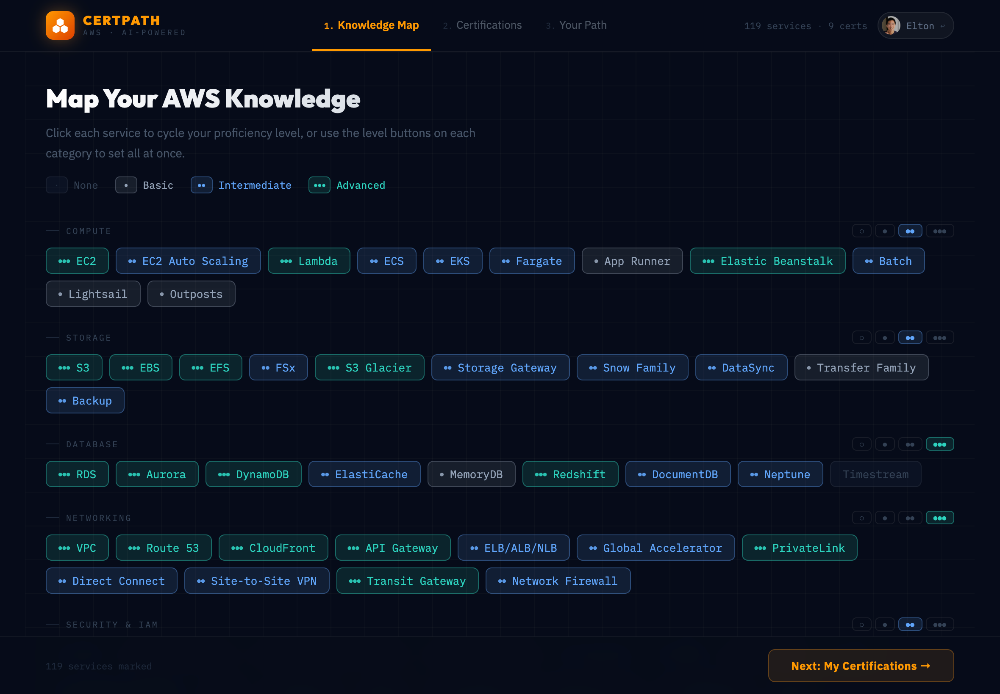
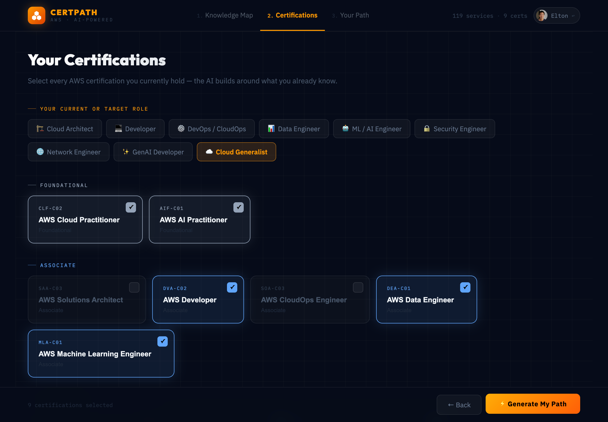
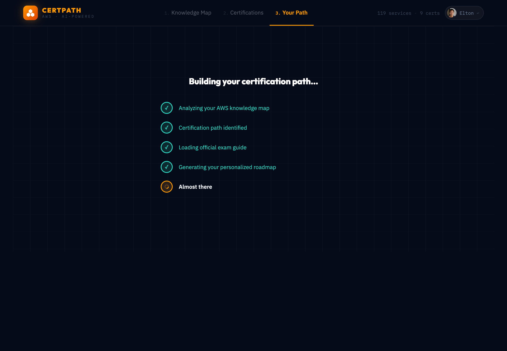
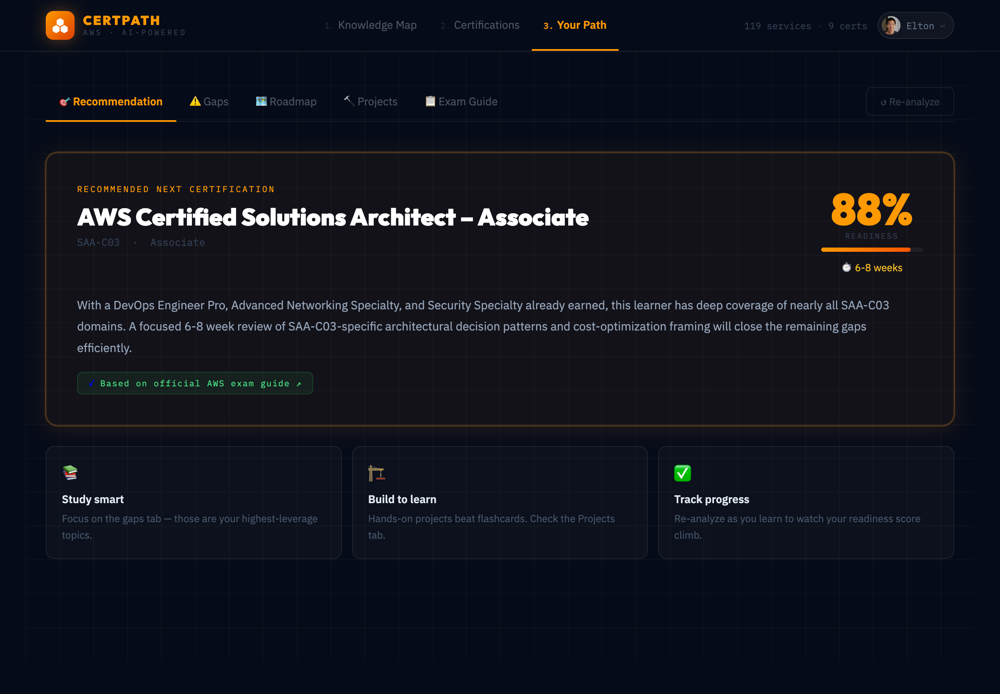

# AWS CertPath

**AI-powered AWS certification roadmap generator** — you map your knowledge across 100+ AWS services, select your target role, and receive a personalized study plan grounded in official AWS exam content.

🔗 **Live demo:** [esaheki.com/aws](https://esaheki.com/aws)

---

## What it does

Most "what cert should I study for?" advice is generic. This app is not.

You rate your proficiency across every major AWS service, mark the certifications you already hold, and pick a target role (Architect, Developer, DevOps, Security, ML/AI, etc.). A multi-step AI pipeline — guided by official AWS exam guide content — produces:

- **Cert recommendation** with a readiness percentage and realistic timeline
- **Prioritized knowledge gaps** mapped to your specific role
- **Phase-by-phase study roadmap** tied to official exam domains and their weights
- **Hands-on project ideas** scoped to your current skill level

Your profile is persisted in DynamoDB and restored on every login, so the app stays useful over months of study.

---

## Screenshots

| Step 1 — Knowledge Map | Step 2 — Your Certifications |
|---|---|
|  |  |
| Rate proficiency across 100+ AWS services, grouped by category. | Mark certs you already hold and select your target role. |

| Step 3 — AI Pipeline Running | Step 4 — Your Path |
|---|---|
|  |  |
| Real-time progress as the durable orchestrator runs classify → fetch exam docs → generate analysis. | Cert recommendation with readiness %, timeline, knowledge gaps, study roadmap, and hands-on projects. |

---

## Architecture highlights

This project was intentionally over-engineered relative to its scope. The goal was to explore production patterns — durable orchestration, IAM-only AI auth, prompt caching, Well-Architected hardening — in a real end-to-end system.

### Lambda Durable Functions for multi-step AI orchestration

The analysis pipeline runs as a durable workflow: classify → fetch exam docs → generate analysis. Using [`@aws/durable-execution-sdk-js`](https://docs.aws.amazon.com/lambda/latest/dg/durable-functions.html), each step is checkpointed automatically. If any step fails, the orchestrator retries from the last checkpoint — not from the beginning.

```
POST /analyze
  └── analyze-start → fires durable orchestrator (qualified ARN via live alias)
        └── analyze-orchestrator
              ├── step 1: analyze-classify    (Haiku 4.5)  ~2s   → cert code
              ├── step 2: analyze-fetch-docs  (DynamoDB)   ~1s   → exam domains JSON
              └── step 3: analyze-final       (Sonnet 4.6) ~15s  → full enriched analysis
```

The frontend polls `GET /analyze/{id}` → DynamoDB for status + result. Human-readable progress messages are written to DynamoDB between steps and surfaced in the UI.

### Bedrock prompt caching for repeat requests

`analyze-final` splits its system prompt at a `cachePoint`. The static block (exam guide domains per cert code) is cached by Bedrock across requests; the dynamic block (user's knowledge map and role) is not. This cuts latency by ~85% and cost accordingly on repeat requests for the same cert.

### IAM authentication — no API keys anywhere

All Bedrock calls use IAM `bedrock:InvokeModel` with scoped model ARNs. No `ANTHROPIC_API_KEY`, no secrets rotation, no risk of key leakage. Lambda execution roles are scoped per function.

### Pre-extracted exam guide cache

An EventBridge cron fires on the 1st of each month, scrapes the official AWS exam guide pages, and runs them through Haiku to extract structured domain + weight data. This is stored in `certpath-examguides` (DynamoDB). The analysis pipeline reads this cache in step 2 — the final Sonnet call is always grounded in official exam content, not hallucinated domain names.

### GitHub Actions CI/CD with OIDC

Every PR runs lint → build → `cdk diff` as a gate. Merges to main trigger `cdk deploy` automatically. No long-lived AWS credentials in GitHub — the pipeline assumes a scoped IAM role (`certpath-github-actions`) via OIDC, which in turn chains into the CDK bootstrap deployer roles. The role ARN is stored as a GitHub repository variable, not a secret.

### Full observability stack

- **CloudWatch dashboard** (`certpath`): analysis volume, input/output/cache tokens per model, Bedrock cache hit rate %, estimated cost/hr, avg cost per analysis
- **CloudWatch alarms** → SNS email: orchestrator errors, API Gateway 5xx, cron failures, DLQ depth
- **X-Ray** active tracing on all 9 Lambda functions
- **Structured JSON logs**: every Lambda emits `{ level, message, ...ctx }` — CloudWatch Logs Insights queryable

---

## System diagram

```
Browser (React + Vite)
  │
  ├── S3 + CloudFront          esaheki.com/aws
  │
  ├── Cognito User Pool         Google OAuth 2.0 · custom domain auth.esaheki.com
  │
  └── API Gateway (Cognito authorizer)
        ├── POST /analyze        → analyze-start → durable orchestrator
        │                              ├── classify    (Haiku)
        │                              ├── fetch-docs  (DynamoDB)
        │                              └── final       (Sonnet, prompt-cached)
        │
        ├── GET  /analyze/{id}   → analyze-status → certpath-executions DynamoDB
        ├── GET  /profile        → profile-get
        └── POST /profile        → profile-save
              └── DynamoDB
                    ├── certpath-profiles     user knowledge maps + roles + owned certs
                    ├── certpath-examguides   official exam domain cache (monthly refresh)
                    └── certpath-executions   execution status + AI results

EventBridge cron (monthly)
  └── populate-exam-guides
        └── AWS docs (.md) → Haiku extract → certpath-examguides DynamoDB
```

---

## Tech stack

| Layer | Technology |
|---|---|
| Frontend | React 18 + Vite, inline styles |
| Auth | AWS Cognito + Google OAuth 2.0 |
| AI (classification) | Claude Haiku 4.5 via Amazon Bedrock |
| AI (analysis) | Claude Sonnet 4.6 via Amazon Bedrock (prompt-cached) |
| Orchestration | Lambda Durable Functions (`@aws/durable-execution-sdk-js`) |
| API | API Gateway (HTTP) + Cognito authorizer |
| Storage | DynamoDB (3 tables) |
| Hosting | S3 + CloudFront |
| Infrastructure | AWS CDK (TypeScript) v2.257 |
| Observability | CloudWatch · X-Ray · SNS alarms |

---

## Project structure

```
aws-certpath/
├── src/                              Frontend (React + Vite)
│   ├── App.jsx                       Root — step nav, poll loop, sessionStorage resume
│   ├── components/
│   │   ├── KnowledgeMap.jsx          Step 1: service proficiency map (10 categories)
│   │   ├── Certifications.jsx        Step 2: owned cert checklist
│   │   └── Analysis.jsx              Step 3: AI result + progress + exam domains tab
│   ├── config/
│   │   ├── services.js               AWS service catalog (10 categories, 100+ services)
│   │   └── certifications.js         Certification data (12 certs + paths)
│   └── lib/
│       ├── analysis.js               startAnalysis() + pollAnalysis()
│       └── auth.js                   Cognito helpers
│
├── backend/functions/
│   ├── analyze-start/                Validates request, rate-limits (5 min), fires orchestrator
│   ├── analyze-orchestrator/         Durable: classify → fetch-docs → final
│   ├── analyze-classify/             Haiku: role-aware cert code selection
│   ├── analyze-fetch-docs/           DynamoDB: read pre-extracted exam domains
│   ├── analyze-final/                Sonnet: grounded full analysis (prompt-cached)
│   ├── analyze-status/               DynamoDB poll → status + result
│   ├── profile-get/                  DynamoDB read
│   ├── profile-save/                 DynamoDB write
│   └── populate-exam-guides/         Monthly cron: AWS docs → Haiku → DynamoDB
│
└── infrastructure/
    └── lib/certpath-stack.ts         Full CDK stack — Cognito, API GW, Lambda, DynamoDB, S3/CF
```

---

## Running locally

```bash
npm install
cp .env.example .env.local
# Fill in Cognito + API Gateway values (requires a deployed stack)
npm run dev
# → http://localhost:5173
```

Local dev calls the same API Gateway → Lambda → Bedrock pipeline as production. AWS credentials (`aws configure`) are required.

## Deploying to AWS

```bash
# 1. Bootstrap CDK (first time per account/region)
cd infrastructure && npm install
npx cdk bootstrap

# 2. Deploy the stack
npx cdk deploy
# Copy the output values into .env.local

# 3. Seed the exam guide cache
aws lambda invoke --function-name certpath-populate-exam-guides /tmp/out.json
cat /tmp/out.json   # verify 11+ certs populated

# 4. Build and upload the frontend
cd .. && npm run build
cd infrastructure && npx cdk deploy
```

**Prerequisites:** AWS CLI configured, Node.js 22+, Bedrock model access enabled for `claude-haiku-4-5-20251001` and `claude-sonnet-4-6`.
